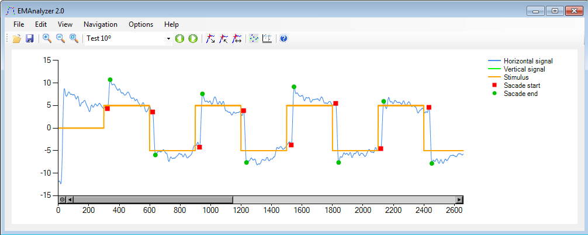
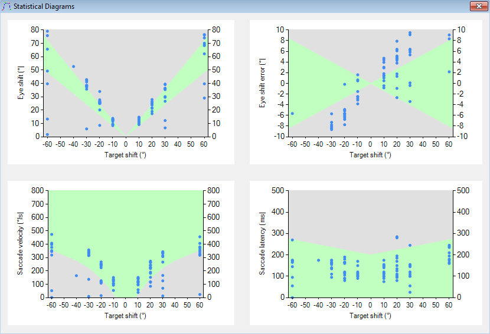
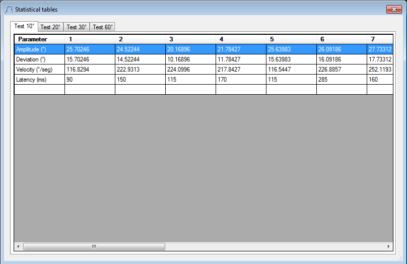

# EMAnalyzer 2.0

**EMAnalyzer 2.0** is a software for electro oculography signal analysis. This is especially needed for the study, diagnosis and prognosis of different central nervous system diseases. Although this CAD tool can be used for different diseases it was designed with focus on Hereditary Spinocerebellar Ataxia type 2 and saccadic tests.

EMAnalyzer 2.0 is a software that I developed long ago as part of my Engineering Final Exam. It was in collaboration with the Center of Neuroscience and Signal Processing (CENPIS) Universidad de Oriente, under the supervision of professor Carlos Vázquez Seisdedos, PhD.

EMAnalyzer 2.0 overview

EMAnalyzer 2.0 Statistical Diagrams

EMAnalyzer 2.0 Metric Tables

I decided to open-source this project despite the technology used being old because the developed methods can be ported and re-used by others. Also, the software is functional as of today Feb 15, 2022 and it could be useful for researchers working in this area. 

The software was developed using the C# programming language. The code is compatible with .NET Framework 4.0 - 4.5. Since this technology is old the best way nowadays of editing and compiling the project is using [SharpDevelop](https://github.com/icsharpcode/SharpDevelop/releases) version higher than 4.0. For recent edits, I have used a Windows 7 virtual machine with SharpDevelop 4.4 and all .NET goodies needed as explained in the ShaptDevelop release link shared above(.NET framework 4.5). It also works in Windows 10 (tested).

Features:
- Automatic saccade start and end detection using Triangles Area Algorithm.
- Statistical diagrams showing Target/Eye shift, Saccade velocity, Eye shift error, Saccade latency.
- Statistical tables showing the per detected saccade Target/Eye shift, Saccade velocity, Eye shift error, Saccade latency.
- Signal Zoom In and Zoom Out.
- Saccade begin/end manual edit (Add, Eliminate, Move).
- Compatible with Windows systems from Windows XP to Windows 10. .NET Framework 4.5 needs to be installed.
- It's compatible with OTTOSCREEN equipment*.CSV files [(Otoscreen, Jaeger-Toennies, Hochberg, Germany)](https://web.archive.org/web/19980513213409fw_/http://jaeger-toennies.com/english/Electrophysiology/OtoScreen/document.html). This equipment despite being old is still used in some hospitals. 
- It's compatible with the files group *.CDC, *.INF, *.MRK .*PAT, *.PLG files

Before releasing the software I translated the UI to English from Spanish, re-organized the code, and fixed some minor bugs.

**IMPORTANT:  The software is functional as of today Feb 15, 2022. It's released as is and no further maintenance will be given.** 

#### License

MIT License

Copyright (c) 2017 Francisco Perdigon Romero

Permission is hereby granted, free of charge, to any person obtaining a copy
of this software and associated documentation files (the "Software"), to deal
in the Software without restriction, including without limitation the rights
to use, copy, modify, merge, publish, distribute, sublicense, and/or sell
copies of the Software, and to permit persons to whom the Software is
furnished to do so, subject to the following conditions:

The above copyright notice and this permission notice shall be included in all
copies or substantial portions of the Software.

THE SOFTWARE IS PROVIDED "AS IS", WITHOUT WARRANTY OF ANY KIND, EXPRESS OR
IMPLIED, INCLUDING BUT NOT LIMITED TO THE WARRANTIES OF MERCHANTABILITY,
FITNESS FOR A PARTICULAR PURPOSE AND NONINFRINGEMENT. IN NO EVENT SHALL THE
AUTHORS OR COPYRIGHT HOLDERS BE LIABLE FOR ANY CLAIM, DAMAGES OR OTHER
LIABILITY, WHETHER IN AN ACTION OF CONTRACT, TORT OR OTHERWISE, ARISING FROM,
OUT OF OR IN CONNECTION WITH THE SOFTWARE OR THE USE OR OTHER DEALINGS IN THE
SOFTWARE.

